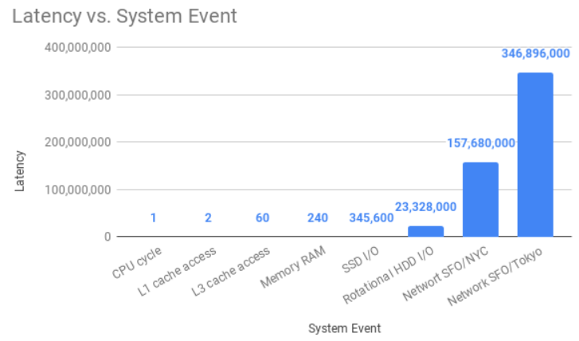

[toc]

### Synchronous（同步） vs Asynchronous（异步）vs Coroutine（协程）

##### 什么是同步和异步？

同步和异步是计算机如何处理任务的思想，以下概念可以抽象描述此思想。需要说明的是，同步和异步与线程、进程、CPU无关，一个线程也可以实现异步。

Oddly enough "Synchronously" means "using the same clock" so when two instructions are synchronous they use the same clock and must happen one after the other. "Asynchronous" means "not using the same clock" so the instructions are not concerned with being in step with each other. 

##### 同步可能造成IO阻塞



在IO操作的过程中，当前线程被挂起，而其他需要CPU执行的代码就无法被当前线程执行了。

因为一个IO操作就阻塞了当前线程，导致其他代码无法执行，所以我们必须使用多线程或者多进程来并发执行代码，为多个用户服务。每个用户都会分配一个线程，如果遇到IO导致线程被挂起，其他用户的线程不受影响。

多线程和多进程的模型虽然解决了并发问题，但是系统不能无上限地增加线程。由于系统切换线程的开销也很大，所以，一旦线程数量过多，CPU的时间就花在线程切换上了，真正运行代码的时间就少了，结果导致性能严重下降。

由于我们要解决的问题是CPU高速执行能力和IO设备的龟速严重不匹配，多线程和多进程只是解决这一问题的一种方法。

##### 如何解决IO阻塞

1. 多进程（multiproccessing)

Multiprocessing is a form of *parallel computing*: instructions are executed in an *overlapping time frame* on *multiple physical processors or cores*.(任务在同一个时间窗口中在多个处理器或内核中执行) Each process spawned by the kernel incurs an overhead cost, including an independently-allocated chunk of memory (heap).

2. 多线程（Threading）

Threading is an alternative to multiprocessing, unlike multiprocessing, however, *threads exist entirely in a single kernel process*, and share a single allocated heap.

The primary downsides to Python threading are *memory safety* and *race conditions*. All child threads of a parent process operate in the same shared memory space. Without additional protections, one thread may overwrite a shared value in memory without other threads being aware of it. Such data corruption would be disastrous.

为了保证多线程安全，Python下的全局解释器锁（英语：Global Interpreter Lock，缩写GIL）防止多个线程执行同一个Python对象，使得任何时候仅有一个线程执行，导致Python多线程性能甚至比单线程更糟。

3. 异步（Asynchrony）

当代码需要执行一个耗时的IO操作时（发送IO阻塞），它只发出IO指令，并不等待IO结果，然后就去执行其他代码了。一段时间后，当IO返回结果时，再通知CPU进行处理。

Asynchrony is an alternative to threading for writing concurrent applications. Asynchronous events occur on independent schedules, "out of sync" with one another, *entirely within a single thread*.

Unlike threading, in asynchronous programs the programmer controls when and how voluntary preemption occurs, making it easier to isolate and avoid race conditions.

#### Coroutine（协程）

在执行函数A过程中，可随时挂起（通过await；同时保存上下文context），去执行函数B，执行完函数B后继续执行函数A（The *await* keyword suspends the execution of the current coroutine, and calls the specified awaitable.）

##### 特定

* 单线程下实现异步和并发（这里并发实为任务间来回切换，不是同时运行）。缓解多线程实现异步和并发中线程切换产生的开销（多线程切换由内核管理，协成中单线程实现异步和并发由程序控制）
* 不需要多线程的锁机制，因为只有一个线程，也不存在同时写变量冲突，在协程中控制共享资源不加锁，只需要判断状态就好了，所以执行效率比多线程高很多
* 单线程下实现并发，是将IO阻塞时间用于执行计算，可以提高效率

##### 实现

* Python对协程的支持，是通过生成器（Generator）实现的，协程师遵循某些规则的生成器。
* Python 3.4后内置了asyncio标准库，官方真正实现了协程这一特性，3.5中引入async/await语法，即，*@asyncio.coroutine*等同于*async*，*yield from*替换为*await*

##### 名词/概念

* Any object which can be awaited (voluntarily preempted by a coroutine) is called an *awaitable*.
* The *await* keyword suspends the execution of the current coroutine and calls the specified *awaitable*.
* Awaitables can be gathered as a group by using *asyncio.gather(awaitebles)*
* The *event loop*(循环消息) controls the scheduling and communication of awaitable objects. Every asyncio program has at least one *event loop*.

##### 代码实例

*asyncio.sleep(1)*（属于awaitable类型）可以看作是耗时1秒阻塞IO，在此期间，主线程并未等待，而是去执行`EventLoop`中其他可以执行的`coroutine`了，因此可以实现并发执行。

```python
import threading
import asyncio

@asyncio.coroutine
def hello():
    print('Hello world! (%s)' % threading.currentThread())
    yield from asyncio.sleep(1)
    print('Hello again! (%s)' % threading.currentThread())

loop = asyncio.get_event_loop()
#tasks = [hello(), hello()]
#loop.run_until_complete(asyncio.wait(tasks))
#tasks = []
loop.run_until_complete(asyncio.gather(hello(), hello()))
loop.close()
```

```
Hello world! (<_MainThread(MainThread, started 140735195337472)>)
Hello world! (<_MainThread(MainThread, started 140735195337472)>)
(暂停约1秒)
Hello again! (<_MainThread(MainThread, started 140735195337472)>)
Hello again! (<_MainThread(MainThread, started 140735195337472)>)
```


https://www.liaoxuefeng.com/wiki/1016959663602400/1048430311230688

https://www.cnblogs.com/dbf-/p/11143349.html

https://stackabuse.com/overview-of-async-io-in-python-3-7/

https://www.jianshu.com/p/84df78d3225a

https://www.cnblogs.com/tashanzhishi/p/10774515.html

https://djangostars.com/blog/asynchronous-programming-in-python-asyncio/

https://www.capitalone.com/tech/software-engineering/async-processing-in-python-for-faster-data-pipelines/

https://docs.python.org/3/library/asyncio-task.html

https://stackabuse.com/python-async-await-tutorial/

### Inheritance and Composition

(略)

### Unit Test and Test Cases

* Unit Test: A unit test verifies that one specific aspect of a fundtion's behaviro is correct
* Test Case: A test case is a collection of unit tests that together prove that a function behaves as it's supposed to, within the full range of situations you expect it to handle.

*Pytest* expects our tests to be located in files whose names begin with `test_` or end with `_test.py`

```python
# wallet.py

class InsufficientAmount(Exception):
    pass


class Wallet(object):

    def __init__(self, initial_amount=0):
        self.balance = initial_amount

    def spend_cash(self, amount):
        if self.balance < amount:
            raise InsufficientAmount('Not enough available to spend {}'.format(amount))
        self.balance -= amount

    def add_cash(self, amount):
        self.balance += amount
```

```python
# test_wallet.py

import pytest
from wallet import Wallet, InsufficientAmount


def test_default_initial_amount():
    wallet = Wallet()
    assert wallet.balance == 0

def test_setting_initial_amount():
    wallet = Wallet(100)
    assert wallet.balance == 100

def test_wallet_add_cash():
    wallet = Wallet(10)
    wallet.add_cash(90)
    assert wallet.balance == 100

def test_wallet_spend_cash():
    wallet = Wallet(20)
    wallet.spend_cash(10)
    assert wallet.balance == 10

def test_wallet_spend_cash_raises_exception_on_insufficient_amount():
    wallet = Wallet()
    with pytest.raises(InsufficientAmount):
        wallet.spend_cash(100)
```

*pytest fixture* helps us set up some helper code that should run before any tests are executed, and are perfect for setting-up resources that are needed by the tests.

```python
# test_wallet.py

import pytest
from wallet import Wallet, InsufficientAmount

@pytest.fixture
def empty_wallet():
    '''Returns a Wallet instance with a zero balance'''
    return Wallet()

@pytest.fixture
def wallet():
    '''Returns a Wallet instance with a balance of 20'''
    return Wallet(20)

def test_default_initial_amount(empty_wallet):
    assert empty_wallet.balance == 0

def test_setting_initial_amount(wallet):
    assert wallet.balance == 20

def test_wallet_add_cash(wallet):
    wallet.add_cash(80)
    assert wallet.balance == 100

def test_wallet_spend_cash(wallet):
    wallet.spend_cash(10)
    assert wallet.balance == 10

def test_wallet_spend_cash_raises_exception_on_insufficient_amount(empty_wallet):
    with pytest.raises(InsufficientAmount):
        empty_wallet.spend_cash(100)
```


### Decorator

一切皆对象，我们在开发过程中定义的变量、方程、类、实例等都是对象，并且这些对象是可以传递的，对象间的可传递性可以为我们实现一个“闭包”，而“闭包”就是实现一个装饰器的基础。装饰器可以在不修改原方法的情况下，给方法增加额外的功能。

***闭包：在Python中允许在一个方法中嵌套另一个方法，这种特殊的机制***

假设我们实现一个统计方法执行时间的方程。

```python
import time

def hello():
    start = time.time()
    time.sleep(1)
    print("hello")
    end = time.time()
    print("duration time: %ds" % int(end - start))
   
hello()
```

```
hello
duration time: 1s
```

将时间统计逻辑抽离出来定义一个方程

```python
import time

def timeit(func):   # 计算方法耗时的通用方法
    start = time.time()
    func()          # 执行方法
    end = time.time()
    print("duration time: %ds" % int(end - start))

def hello():
    time.sleep(1)
    print("hello")

timeit(hello) 

timeit(func1)   # 计算func1执行时间
timeit(func2)   # 计算func2执行时间
```

```
hello
duration time: 1s
```

将```hello()```加入时间统计逻辑，不需将```hello()```导入```timeit```，直接调用```hello()```即可

```python
import time

def timeit(func):
    def inner():
        start = time.time()
        func()
        end = time.time()
        print("duration time: %ds" % int(end - start))
    return inner

def hello():
    time.sleep(1)
    print("hello")

hello = timeit(hello)   # 重新定义hello
hello()       # 像调用原始方法一样使用

```

```
hello
duration time: 1s
```

使用decorator装饰器可以实现同样的效果

```python
import time

def timeit(func):
    def inner():
        start = time.time()
        func()
        end = time.time()
        print("duration time: %ds" % int(end - start))
    return inner

@timeit   # 相当于 hello = timeit(hello)
def hello():
    time.sleep(1)
    print('hello')

hello()  # 直接调用原方法即可
```

装饰带参数的方法和带参数的装饰器

```python
import time
from functools import wraps

def timeit(prefix):  # 装饰器可传入参数
    def decorator(func): # 多一层方法嵌套
        @wraps(func)
        def wrapper(*args, **kwargs):
            start = time.time()
            func(*args, **kwargs)
            end = time.time()
            print('%s: duration time: %ds' % (prefix, int(end - start)))
        return wrapper
    return decorator

@timeit('prefix1')
def hello(name):
    time.sleep(1)
    print('hello %s' % name)
    
hello('daniel')
```

```
hello daniel
prefix1: duration time: 1s
```

```python
@timeit('prefix2')
def say(name, age):
    time.sleep(1)
    print('hello %s %s' % (name, age))

say('Jack', 23)
```

```
hello Jack 23
prefix2: duration time: 1s
```

知道了如何实现一个装饰器，那么我们可以在不修改原方法的情况下，给方法增加额外的功能，这就非常适合给方法集成一些通用的逻辑，例如记录日志、记录执行耗时、本地缓存、路由映射等功能。

路由映射案例

```python
class Router(object):

    def __init__(self):
        self.url_map = {}

    def register(self, url):
        def wrapper(func):
            self.url_map[url] = func
        return wrapper

    def call(self, url):
        func = self.url_map.get(url)
        if not func:
            raise ValueError('No url function: %s', url)
        return func()

router = Router()

@router.register('/page1')
def page1():
    return 'this is page1'

@router.register('/page2')
def page2():
    return 'this is page2'

print(router.call('/page1'))
```

```
this is page1
```

```python
print(router.call('/page2'))
```

```
this is page2
```


### Method Type

class method vs static method vs instance method 


测试文章

1、https://segmentfault.com/a/1190000022900834?utm_source=sf-related

2、单元测试 vs 集成测试 vs 系统测试 vs 验收测试： https://segmentfault.com/a/1190000009358979?utm_source=sf-related

3、装饰器：https://zhuanlan.zhihu.com/p/305604008


